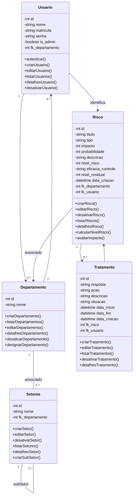

# Diagrama Entidade-Relacionamento

```dbml
    USUARIO {
        int id
        string nome
        string matricula
        string senha
        boolean is_admin
        int fk_departamento
    }

    DEPARTAMENTO {
        int id
        string nome
    }

    RISCO {
        int id
        string titulo
        string tipo
        int impacto
        int probabilidade
        string descricao
        int nivel_risco
        string eficacia_controle
        int nivel_residual
        datetime data_criacao
        int fk_usuario
        int fk_departamento
    }

    TRATAMENTO {
        int id
        string resposta
        string acao
        string descricao
        string situacao
        datetime data_inicio
        datetime data_fim
        datetime data_criacao
        int fk_risco
    }

    %% RELACIONAMENTOS
    DEPARTAMENTO ||--o{ USUARIO : possui
    USUARIO ||--o{ RISCO : cria
    DEPARTAMENTO ||--o{ RISCO : associado
    RISCO ||--o{ TRATAMENTO : possui
```


# Diagrama de caso de uso


# Diagrama de classes


