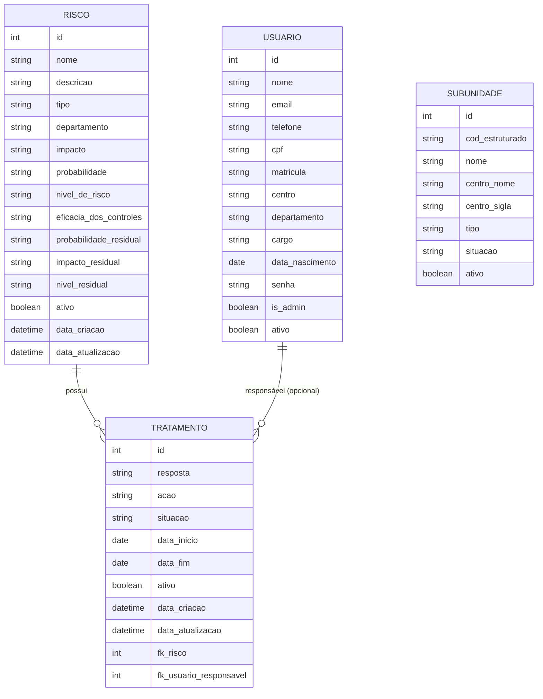
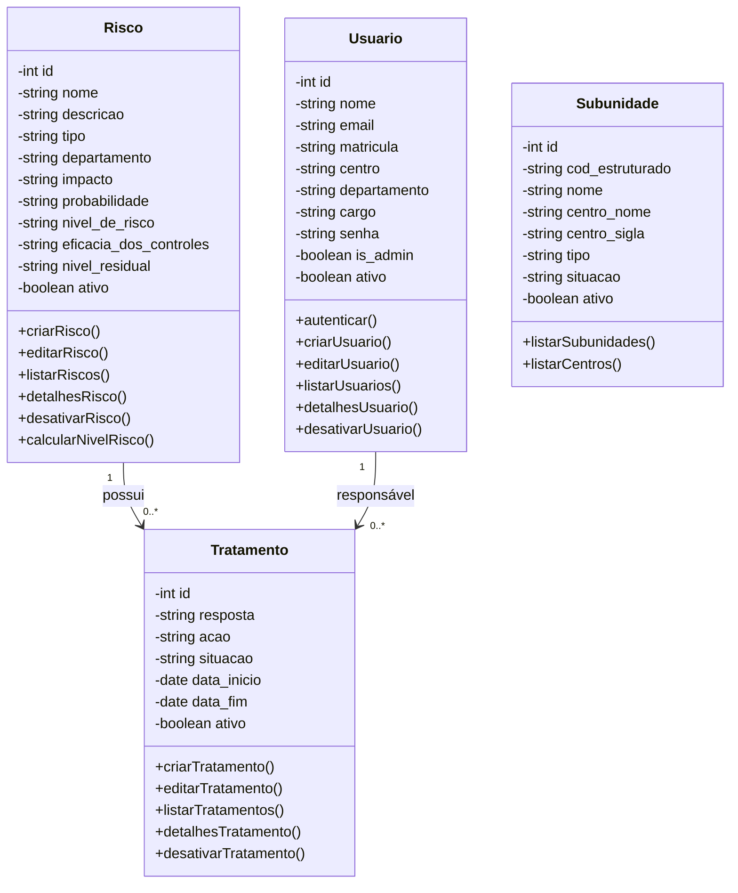
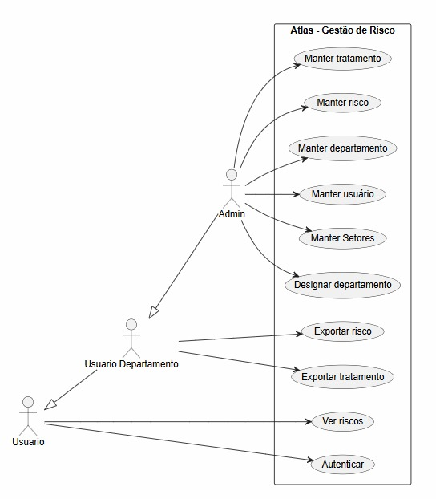

# software-formularios-rupturacode

Sistema de **cadastro e gestão de riscos** (domínio UFSM). O backend Django 6 expõe uma API JSON e
também serve o SPA já compilado; o frontend é React 19 + Vite 8. Banco SQLite.

## Sumário

* [Stack](#stack)
* [Estrutura de pastas](#estrutura-de-pastas)
* [Pré-requisitos](#pré-requisitos)
* [Instalação](#instalação)
* [Como rodar](#como-rodar)
* [Testes](#testes)
* [API](#api)
* [Diagramas](#diagramas)
* [Desenvolvedores](#desenvolvedores)
* [Bibliografia](#bibliografia)

## Stack

| Camada   | Tecnologias                                                              |
|----------|--------------------------------------------------------------------------|
| Backend  | Django 6, SQLite, deps via `uv` (`pyproject.toml` / `uv.lock`)           |
| Frontend | React 19, Vite 8, react-router-dom, echarts, framer-motion, react-hook-form |

Arquitetura **dois tiers, mesma origem em prod**: o Django serve o SPA Vite compilado (sem servidor
web separado). Em dev rodam-se Vite e Django separados, com o Vite fazendo proxy de `/api` para o
Django. A API é escrita à mão (function views retornando `JsonResponse`, sem DRF) e a auth é baseada
em sessão.

## Estrutura de pastas

```
software-formularios-rupturacode/
├── backend/                  # Django (rode os comandos de backend daqui)
│   ├── atlas/                # settings, urls, wsgi/asgi (projeto Django)
│   ├── core/                 # dashboard, auth, view que serve o SPA
│   ├── riscos/               # app Risco (+ scoring)
│   ├── tratamentos/          # app Tratamento
│   ├── usuario/              # app Usuario (auth por sessão)
│   ├── subunidade/           # unidades UFSM (import via CSV)
│   ├── manage.py
│   └── db.sqlite3
├── frontend/                 # React + Vite
│   ├── src/                  # components, pages, hooks, lib/api.js
│   └── dist/                 # build gerado (o que o Django serve em prod)
├── docs/                     # mkdocs
├── .venv/                    # virtualenv Python
├── pyproject.toml / uv.lock  # deps Python (uv)
└── requirements.txt          # espelho fixado das deps
```

## Pré-requisitos

| Configuração        | Valor                    |
|---------------------|--------------------------|
| Sistema operacional | Windows 10/11 (64 bits)  |
| Python              | ≥ 3.12                   |
| Node.js / npm       | Node 20+ recomendado     |
| Necessita rede?     | Sim                      |

## Instalação

```powershell
# 1. Backend (na raiz do repo) — cria/usa o .venv e instala deps Python
uv sync
# alternativa sem uv:
# python -m venv .venv; .venv\Scripts\python -m pip install -r requirements.txt

# 2. Frontend
cd frontend
npm install
cd ..
```

## Como rodar

> Os comandos de backend rodam **de dentro de `backend/`** (a descoberta de testes e o `cwd` do
> Django dependem disso). No Windows use o venv da raiz: `..\.venv\Scripts\python`.

### Dev (dois servidores)

```powershell
# Terminal 1 — backend
cd backend
..\.venv\Scripts\python manage.py migrate
..\.venv\Scripts\python manage.py runserver        # http://127.0.0.1:8000

# Terminal 2 — frontend (proxy /api -> 127.0.0.1:8000)
cd frontend
npm run dev
```

### Tipo-prod (mesma origem)

```powershell
cd frontend
npm run build                                       # gera frontend/dist
cd ..\backend
..\.venv\Scripts\python manage.py runserver         # Django serve o SPA compilado
```

Sem `frontend/dist`, a rota índice retorna 503 pedindo o build.

**Login de dev (seed):** `admin@atlas.com` / `1234`.

**Importar unidades UFSM:** `..\.venv\Scripts\python manage.py import_unidades [caminho_csv]` (CSV em
UTF-8; upsert por `cod_estruturado`, reexecutável).

## Testes

```powershell
cd backend
..\.venv\Scripts\python manage.py test                                                  # tudo
..\.venv\Scripts\python manage.py test riscos                                           # um app
..\.venv\Scripts\python manage.py test riscos.tests.RiscoTests.test_criar_risco_valido  # único
```

## API

Endpoints sob `/api/` (respostas em camelCase; auth por sessão; soft delete via flag `ativo`):

| Método              | Rota                                  | Descrição                          |
|---------------------|---------------------------------------|------------------------------------|
| GET                 | `/api/dashboard/`                     | Resumo do dashboard                |
| GET / POST          | `/api/riscos/`                        | Listar / criar risco               |
| GET / PUT / DELETE  | `/api/riscos/<id>/`                   | Detalhe / editar / desativar       |
| GET / POST          | `/api/usuarios/`                      | Listar / criar usuário             |
| GET / PUT / DELETE  | `/api/usuarios/<id>/`                 | Detalhe / editar / desativar       |
| GET                 | `/api/subunidades/`                   | Unidades UFSM                      |
| GET                 | `/api/subunidades/centros/`           | Centros (siglas)                   |
| POST                | `/api/auth/login/` `/logout/`         | Login / logout                     |
| GET                 | `/api/auth/me/`                       | Sessão atual                       |
| POST                | `/api/auth/password-reset/{request,verify,confirm}/` | Reset de senha por código |

## Diagramas

### Entidade-Relacionamento


```mermaid
erDiagram
    USUARIO {
        int id
        string nome
        string email
        string telefone
        string cpf
        string matricula
        string centro
        string departamento
        string cargo
        date data_nascimento
        string senha
        boolean is_admin
        boolean ativo
    }

    RISCO {
        int id
        string nome
        string descricao
        string tipo
        string departamento
        string impacto
        string probabilidade
        string nivel_de_risco
        string eficacia_dos_controles
        string probabilidade_residual
        string impacto_residual
        string nivel_residual
        boolean ativo
        datetime data_criacao
        datetime data_atualizacao
    }

    TRATAMENTO {
        int id
        string resposta
        string acao
        string situacao
        date data_inicio
        date data_fim
        boolean ativo
        datetime data_criacao
        datetime data_atualizacao
        int fk_risco
        int fk_usuario_responsavel
    }

    SUBUNIDADE {
        int id
        string cod_estruturado
        string nome
        string centro_nome
        string centro_sigla
        string tipo
        string situacao
        boolean ativo
    }

    RISCO   ||--o{ TRATAMENTO : possui
    USUARIO ||--o{ TRATAMENTO : "responsável (opcional)"
```

> `SUBUNIDADE` não tem FK física: alimenta os selects de centro/departamento via API; em
> `USUARIO`/`RISCO`, `centro` (sigla) e `departamento` (nome da unidade) são guardados como string.

### Classes


```mermaid
classDiagram
    class Usuario {
        -int id
        -string nome
        -string email
        -string matricula
        -string centro
        -string departamento
        -string cargo
        -string senha
        -boolean is_admin
        -boolean ativo
        +autenticar()
        +criarUsuario()
        +editarUsuario()
        +listarUsuarios()
        +detalhesUsuario()
        +desativarUsuario()
    }

    class Risco {
        -int id
        -string nome
        -string descricao
        -string tipo
        -string departamento
        -string impacto
        -string probabilidade
        -string nivel_de_risco
        -string eficacia_dos_controles
        -string nivel_residual
        -boolean ativo
        +criarRisco()
        +editarRisco()
        +listarRiscos()
        +detalhesRisco()
        +desativarRisco()
        +calcularNivelRisco()
    }

    class Tratamento {
        -int id
        -string resposta
        -string acao
        -string situacao
        -date data_inicio
        -date data_fim
        -boolean ativo
        +criarTratamento()
        +editarTratamento()
        +listarTratamentos()
        +detalhesTratamento()
        +desativarTratamento()
    }

    class Subunidade {
        -int id
        -string cod_estruturado
        -string nome
        -string centro_nome
        -string centro_sigla
        -string tipo
        -string situacao
        -boolean ativo
        +listarSubunidades()
        +listarCentros()
    }

    Risco "1" --> "0..*" Tratamento : possui
    Usuario "1" --> "0..*" Tratamento : responsável
```

### Caso de uso



## Desenvolvedores

* Andrei Cecatto
* Arthur Novak
* Jackson Moraes
* Lorenzo dos Reis Marty

## Bibliografia

* [Documentação do Django](https://docs.djangoproject.com/)
* [Documentação do Vite](https://vite.dev/)
* [Documentação do React](https://react.dev/)
